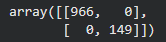

# 🤖 SMS Spam Classification using Transformer


A natural language processing project that classifies SMS messages as **spam or ham** using a **Transformer-based model**, demonstrating modern deep learning techniques for text classification.

---

## 📌 Project Overview

This project applies a **Transformer architecture** for SMS spam classification.  
The model is trained on labeled SMS messages and evaluated using a confusion matrix to measure classification performance.

The workflow includes:
- Text preprocessing
- Transformer-based training
- Model evaluation and visualization

---

## 📁 Project Structure

- SMSSpamCollection — Dataset used to train and tune the model  
- spam_classification.ipynb — Main project notebook  
- requirements.txt — Required libraries to run the project  
- confusion_matrix.png — Confusion matrix after training  
- README.md — Project documentation  

---

## 📦 Requirements

Install dependencies using:

pip install -r requirements.txt

Main libraries used include:
- transformers
- torch
- scikit-learn
- nltk
- pandas
- matplotlib

(See full list in requirements.txt)

---

## 🧠 Model

- Architecture: Transformer-based text classifier  
- Task: Binary Text Classification (Spam vs Ham)  
- Framework: HuggingFace Transformers + PyTorch  

---

## 📊 Model Evaluation

The confusion matrix below shows model performance after training.



The model demonstrates strong classification ability with clear separation between spam and non-spam messages.

---

## ▶️ How to Run

1. Clone the repository  
```text
git clone https://github.com/btboilerplate/sms-spam-classification-transformer.git  
```

2. Install dependencies  
```text
pip install -r requirements.txt  
```

3. Open spam_classification.ipynb and run all cells sequentially  

---

## 🧪 Key Takeaways

- Transformer models capture contextual meaning better than traditional NLP methods  
- Achieves strong spam detection performance  
- Demonstrates modern NLP workflow using HuggingFace Transformers  

---

## 👨‍💻 Author

Nishant Kumar  
B.Tech – Artificial Intelligence & Machine Learning  

---

⭐ If you found this project helpful, consider giving it a star!
